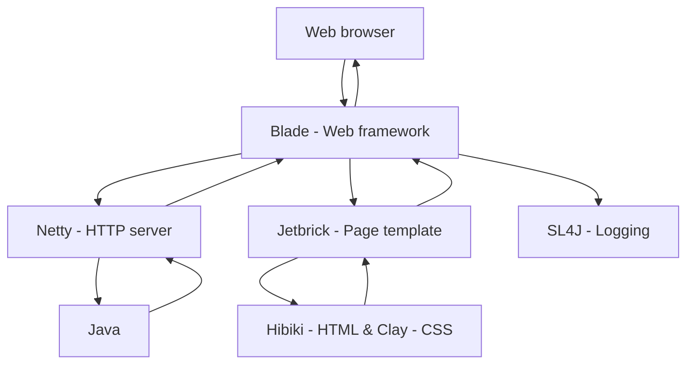

# web-example-basic

### Table of contents
1. [Version](https://github.com/murtidaryandono/web-example-basic#1-version) <br/>
2. [Description](https://github.com/murtidaryandono/web-example-basic#2-description) <br/>
3. [Technology stack](https://github.com/murtidaryandono/web-example-basic#3-technology-stack) <br/>
4. [Architecture](https://github.com/murtidaryandono/web-example-basic#4-architecture) <br/>
5. [Sequence diagram](https://github.com/murtidaryandono/web-example-basic#5-sequence-diagram) <br/>
6. [Project structure](https://github.com/murtidaryandono/web-example-basic#6-project-structure) <br/>
7. [Tutorial](https://github.com/murtidaryandono/web-example-basic#7-tutorial) <br/>
8. [Environment properties](https://github.com/murtidaryandono/web-example-basic#8-environment-properties) <br/>
9. [Run application](https://github.com/murtidaryandono/web-example-basic#9-run-application) <br/>
10. [Tools](https://github.com/murtidaryandono/web-example-basic#10-tools) <br/>
11. [Author](https://github.com/murtidaryandono/web-example-basic#11-author)

---
### 1. Version
| Date | Version | Author | Changelog |
| --- | --- | --- | --- |
| 2022-01-31 | 1.0.0 | Murti Daryandono | Initial release |
---

### 2. Description
**web-example-basic** is a sample project that intended to help Java developers create basic web application using Java
based technologies based on MVC (Model View Controller) concept.
In this sample project, some feature will be provided, such as :
- Page templating
- Read environment properties
- Connection to back end REST services
- Service class based on business logic
- Controller class to handle request and response that comply with REST format (GET, DELETE, POST, PUT, PATCH)
- Test REST service
---

### 3. Technology stack
- Blade : Java web framework (here are [blade link](https://github.com/lets-blade/blade) & [baeldung link](https://www.baeldung.com/blade))
- Gson : JSON manipulation tools from Google ([Gson link](https://github.com/google/gson))
- Jetbrick : Java page templating ([Jetbrick link](https://github.com/lets-blade/blade-demos/tree/master/blade-template))
- SL4J : Java logging framework
- Project Lombok : Java getter & setter auto generation ([Project Lombok link](https://projectlombok.org/))
- JUnit : Java unit test framework
- Hibiki : HTML framework without JS ([Hibiki link](https://github.com/dashborg/hibiki))
- Clay : CSS framework implementing Lexicon design ([Clay link](https://clayui.com/))
---

### 4. Architecture


---

### 5. Sequence diagram

---

### 6. Project structure
```
project : web-example-basic
+-- pom.xml
+-- README.md
+-- README.img
|   +-- setup_maven_1.png
|   +-- setup_maven_2.png
+-- src
|   +-- main
|       +-- java
|           +-- id
|               +-- daryandono
|                   +-- web
|                       +-- Application.java
|                       +-- core
|                           +-- Bootstrap.java
|                       +-- module
|                           +-- example
|                               +-- IndexController.java
|                               +-- IndexService.java
|       +-- resources
|           +-- application.properties
|           +-- application-stg.properties
|           +-- application-prd.properties
|           +-- static
|               +-- css
|                   +-- atlass.css
|               +-- img
|                   +-- icons.svg                    
|   +-- test
|       +-- java
|           +-- id
|               +-- daryandono
|                   +-- web
|                       +-- test
```

---

### 7. Tutorial

---

### 8. Environment properties
| Environment | File properties | 
| --- | --- |
| Development | application.properties | 
| Staging | application-stg.properties | 
| Production | application-prd.properties | 

Contents of environment properties are :

```properties
# server configuration
server.port=[port value where your application will run]

# application configuration
mvc.statics=[path to static directory]
mvc.statics.show-list=[true if you want to be show via url]
```

### 9. Run application

- Run in development environment
```
java -jar target/web-example-basic.jar
```
- Run in staging environment
```
java -jar target/web-example-basic.jar --app.env=stg
```
- Run in production environment
```
java -jar target/web-example-basic.jar --app.env=prd
```
---

### 10. Tools
- [Java 8]() as main language
- [Maven]() as dependency manager
- [IntelliJ]() as Java IDE (Integrated Development Environemnt)
- [Mermaid]() as markdown plugin for diagram
---

### 11. Author
> name : Murti Daryandono <br/>
email : murti.daryandono@gmail.com <br/>
twitter : murti_d <br/>
blog : https://daryandono.id